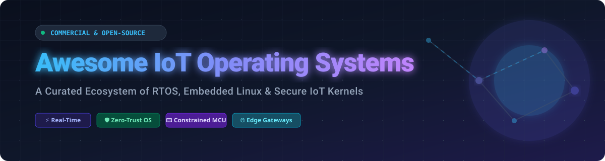

  

# 🌐 Awesome IoT Operating Systems

  
  
  
  

A comprehensive, curated directory of top **IoT Operating Systems (IoT OS)** 📟, Real-Time Operating Systems (RTOS) ⚡, Embedded Linux distributions 🐧, and secure IoT microkernels 🛡️ for microcontrollers, edge gateways, and connected hardware.

*Last updated: October 2026* 📅

---

## 📑 Table of Contents

- [📊 Overview & Market Size](#-overview--market-size)
- [☁️ SaaS & Commercial Platforms](#️-saas--commercial-platforms)
- [🔓 Open-Source GitHub Projects](#-open-source-github-projects)
- [🤝 How to Contribute](#-how-to-contribute)
- [💖 Support & Sponsorship](#-support--sponsorship)
- [📈 Star History](#-star-history)
- [⚠️ Disclaimer](#️-disclaimer)

---

## 📊 Overview & Market Size

The global **IoT Operating System market** 🌐 is valued at approximately **\$2.3 Billion to \$7.0 Billion (2026)** with an estimated Compound Annual Growth Rate (CAGR) of **13% to 35%** 📈.

**Market Dynamics:** The sector is **highly fragmented** 🧩 at the embedded device and hardware layer due to heterogeneous silicon architectures (Cortex-M, RISC-V, ESP32, AVR, x86) and specialized operational constraints (ultra-low power vs. high performance). However, it exhibits **increasing concentration** 🏢 at the cloud management plane around major cloud and enterprise software giants (Microsoft, Amazon AWS, Wind River/Aptiv) offering end-to-end edge-to-cloud security and device lifecycle management.

---

## ☁️ SaaS & Commercial Platforms

| Platform | Enterprise Owner | Company Size (Revenue / Valuation) | Starting Paid Tier Pricing | Free Tier / Trial Limits | Description |
| :--- | :--- | :--- | :--- | :--- | :--- |
| **[Amazon FreeRTOS / AWS IoT](https://aws.amazon.com/freertos/)** | Amazon / AWS | **\$620B+ Revenue** (~\$1.8T+ Valuation) | **\$0.08 per million connection minutes** (AWS IoT Core pricing after free tier) | **12 Months Free Tier:** 2.25M connection minutes/month, 500k messages/month, 225k shadow/registry ops/month | Amazon-supported RTOS libraries optimized for secure connectivity to AWS IoT Core and cloud services. ☁️ |
| **[Azure Sphere OS](https://azure.microsoft.com/products/azure-sphere/)** | Microsoft | **\$245B+ Revenue** (~\$3.1T+ Valuation) | **\$8.60 per chip** (One-time license cost built into certified MCU chip purchase) | **No monthly fee:** Software/OS updates and security services included for life of chip; \$200 Azure cloud trial credit for new accounts | Hardware-rooted Linux OS & security platform bundled with certified silicon for lifecycle updates and zero-trust security. 🔒 |
| **[VxWorks](https://www.windriver.com/products/vxworks)** | Wind River Systems (Aptiv PLC) | **\$400M+ Revenue** (\$4.3B Acquisition Valuation by Aptiv) | **\$18,500 per developer seat** (Base enterprise license quote) | **30-Day Evaluation License:** Available upon enterprise request for qualified projects | Industry-leading commercial RTOS built for safety-critical aerospace, defense, automotive, and industrial automation. 🚀 |
| **[Embedded Linux (Wind River Linux)](https://www.windriver.com/products/linux)** | Wind River Systems (Aptiv PLC) | **\$400M+ Revenue** (\$4.3B Acquisition Valuation by Aptiv) | **\$10,000 per project/year** (Commercial LTS subscription without per-device royalties) | **Free Community Source:** Community-aligned source code available for evaluation without commercial SLA | Production-grade commercial Embedded Linux distribution with long-term maintenance, CVE vulnerability monitoring, and enterprise support. 🐧 |

---

## 🔓 Open-Source GitHub Projects

Curated open-source IoT operating systems and RTOS kernels sorted by GitHub stargazers count (descending) 🌟.

- **[OpenWrt](https://github.com/openwrt/openwrt)**  
    
  Linux operating system targeting embedded network devices and IoT gateways, replacing vendor firmware with customizable package management 📡.

- **[MicroPython](https://github.com/micropython/micropython)**  
    
  Lean and efficient implementation of Python 3 optimized to run on microcontrollers and in constrained environments 🐍.

- **[ESP-IDF](https://github.com/espressif/esp-idf)**  
    
  Official IoT Development Framework for Espressif SoCs (ESP32 series), built on top of FreeRTOS with extensive Wi-Fi/Bluetooth stacks 📶.

- **[Zephyr RTOS](https://github.com/zephyrproject-rtos/zephyr)**  
    
  Modular, secure, open-source RTOS hosted by the Linux Foundation, supporting multi-architecture hardware, Bluetooth Low Energy (BLE), Thread, and low-power IoT applications ⚡.

- **[RT-Thread](https://github.com/RT-Thread/rt-thread)**  
    
  Open-source real-time operating system with rich software components, POSIX thread support, and small memory footprint for MCU IoT hardware 🧠.

- **[FreeRTOS](https://github.com/FreeRTOS/FreeRTOS)**  
    
  Market-leading open-source real-time operating system kernel for microcontrollers, featuring small footprint, high portability, and extensive silicon vendor adoption 🔌.

- **[Tock OS](https://github.com/tock/tock)**  
    
  Embedded operating system designed for microcontrollers, written in Rust to provide memory safety and multiprogramming isolation 🦀.

- **[RIOT OS](https://github.com/RIOT-OS/RIOT)**  
    
  Developer-friendly open-source OS for ultra-low-power IoT devices with C/C++ support, full IPv6 (6LoWPAN, RPL) network stack, and standard POSIX-like APIs 🔋.

- **[ARM Mbed OS](https://github.com/ARMmbed/mbed-os)**  
    
  Open-source embedded operating system designed specifically for Arm Cortex-M devices, providing security, storage, and connectivity drivers 🤖.

- **[Apache NuttX](https://github.com/apache/nuttx)**  
    
  POSIX-compliant mature open-source real-time operating system scalable from 8-bit to 32-bit/64-bit embedded microcontrollers ⚙️.

- **[Hubris OS](https://github.com/oxidecomputer/hubris)**  
    
  Lightweight microkernel RTOS written in Rust by Oxide Computer Company, built for high-reliability embedded system control 🛡️.

- **[Contiki-NG](https://github.com/contiki-ng/contiki-ng)**  
    
  Next-generation open-source operating system focused on low-power wireless sensor networks and IoT mesh communication standards 🕸️.

- **[TinyOS](https://github.com/tinyos/tinyos-main)**  
    
  Component-based, event-driven operating system designed for low-power wireless sensor networks (WSN) 📡.

- **[Yocto Project (Poky)](https://github.com/yoctoproject/poky)**  
    
  Reference distribution and build system tooling for creating custom Linux-based operating systems for embedded hardware and IoT gateways 🛠️.

---

## 🤝 How to Contribute

1. **Fork** the repository 🍴.
2. Add or update entries in `README.md` following the existing format 📝.
3. Ensure open-source entries include the correct GitHub stargazers badge pointing to the repository's `stargazers` page 🏷️.
4. Submit a **Pull Request** with a concise description of your changes 🚀.

---

## 💖 Support & Sponsorship

Thank you for exploring the **Awesome IoT Operating Systems** directory! If you found this list helpful for your research, projects, or hardware deployments, please consider supporting the project:

- ⭐ **Star this repository** to help others discover it!
- 🍴 **Fork and share** it with your fellow firmware engineers and embedded developers.
- ☕ **Buy me a coffee / Sponsor**: If you'd like to support ongoing maintenance and new open-source resource lists, visit my [GitHub Sponsor Dashboard](https://github.com/sponsors/ishandutta2007).

Your support is greatly appreciated! 🙌

---

## 📈 Star History

---

## ⚠️ Disclaimer

This repository is a community-curated collection intended for educational and informational purposes 💡. Operating system choice depends on hardware architecture, real-time requirements, safety certifications, and power constraints. Always perform detailed technical evaluation before deploying software to production IoT devices.

---

*Maintained with ❤️ for embedded software engineers, IoT system architects, and firmware developers.*

